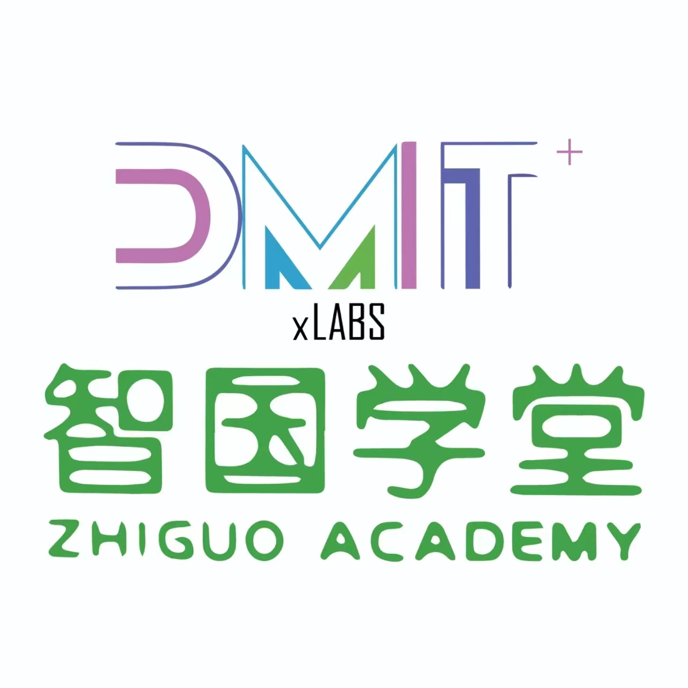

# CCF大模型能力认证（LMCC）课程体系

  

<b>智国学堂 TeachZero · 出品</b>

## 课程简介

CCF大模型能力认证（Large Model Competence Certification，简称LMCC）由中国计算机学会（CCF）主办，是国内权威的大模型领域能力认证考试。本课程由**智国学堂（TeachZero）** 倾力打造，系统覆盖LMCC认证全部知识点，助学员从零基础到掌握大模型核心能力，顺利通过认证考试。

LMCC认证设青少年组（LMCC-T）与成人组（LMCC-A）两组别。考试分两轮：第一轮客观题，考查基础理论与概念理解；第二轮编程题，考查动手实践与模型应用能力。

## 课程概览

本课程共计80课时，分4个级别，逐层递进：

| 级别 | 名称 | 课时 | 定位 |
|:----:|:-----|:----:|:-----|
| LV1 | 人工智能与AI基础 | 20 | 基础素养篇 |
| LV2 | 大模型核心技术 | 20 | 模型原理篇 |
| LV3 | 进阶应用与开发 | 20 | 应用实战篇 |
| LV4 | 伦理安全与认证冲刺 | 20 | 认证冲刺篇 |

## 课程特色

- **体系完整**：从AI基础到认证冲刺，一站式备考方案
- **理论与实践并重**：每级别含实操项目与动手练习，学以致用
- **紧扣考纲**：覆盖LMCC第一轮客观题与第二轮编程题全部考点
- **双组适配**：同时支持青少年组（LMCC-T）与成人组（LMCC-A）备考需求
- **大模型实操贯穿全程**：从API调用到模型微调、部署，真实操作不断线

## 目标学员

- 备考CCF大模型能力认证（LMCC）的考生
- 希望系统学习大模型技术的初学者与进阶者
- 从事AI教育的教师、培训机构讲师
- 对人工智能与大模型感兴趣的自学者

## 前置知识

| 级别 | 前置要求 |
|:----:|:---------|
| LV1 | 无需前置知识，零基础可学 |
| LV2 | 建议先完成LV1，或具备AI基础知识 |
| LV3 | 建议先完成LV2，或具备大模型基础理解 |
| LV4 | 建议先完成LV3，或具备全面的AI与大模型知识 |

## 使用方式

1. 按级别顺序学习：LV1 → LV2 → LV3 → LV4
2. 每课时含教案、课件与配套练习材料
3. 每级别末设阶段性项目与单元测验
4. 建议结合官方资料与在线实操平台同步学习

## 参考资料

- 官方网站：https://lmcc.ccf.org.cn/
- CCF大模型能力认证考试大纲与样题
- 各主流大模型平台API文档

## 课程大纲

### LV1 人工智能与AI基础（基础素养篇）

| 序号 | 课时名称 |
|:----:|:---------|
| 01 | 人工智能是什么 |
| 02 | 人工智能应用领域 |
| 03 | 机器学习基本概念 |
| 04 | 机器学习经典模型 |
| 05 | 深度学习入门 |
| 06 | 自然语言处理基础 |
| 07 | 大模型发展简史 |
| 08 | 大模型的超能力 |
| 09 | 提示词工程入门 |
| 10 | 思维链与推理 |
| 11 | 大模型API调用实践 |
| 12 | Python编程基础 |
| 13 | Python数据处理 |
| 14 | 认识Transformer |
| 15 | 主流大模型介绍 |
| 16 | LMCC认证概览 |
| 17 | LMCC第一轮考点解析 |
| 18 | 综合练习与评测 |
| 19 | 阶段性项目：AI聊天机器人 |
| 20 | 单元总结与测验 |

### LV2 大模型核心技术（模型原理篇）

| 序号 | 课时名称 |
|:----:|:---------|
| 01 | Transformer架构详解 |
| 02 | 自注意力机制深入 |
| 03 | 位置编码 |
| 04 | 主流模型架构对比 |
| 05 | 预训练数据处理 |
| 06 | Tokenization技术 |
| 07 | 预训练任务与目标 |
| 08 | Scaling Law与涌现 |
| 09 | 指令微调SFT |
| 10 | 高效微调技术 |
| 11 | 微调实践（上） |
| 12 | 微调实践（下） |
| 13 | 人类对齐RLHF |
| 14 | 对齐技术进阶 |
| 15 | 模型安全对齐 |
| 16 | 解码策略 |
| 17 | 推理加速技术 |
| 18 | 模型量化与部署 |
| 19 | 实践：模型部署 |
| 20 | 单元总结与测验 |

### LV3 进阶应用与开发（应用实战篇）

| 序号 | 课时名称 |
|:----:|:---------|
| 01 | 提示工程进阶 |
| 02 | RAG技术原理 |
| 03 | RAG实践 |
| 04 | 高级RAG技术 |
| 05 | Function Calling |
| 06 | Agent架构设计 |
| 07 | Agent开发实战 |
| 08 | 多Agent协作 |
| 09 | 复杂推理技术 |
| 10 | 代码生成与执行 |
| 11 | LMCC第二轮编程题解析 |
| 12 | API开发 |
| 13 | 模型评估与测试 |
| 14 | RAG应用项目：知识库问答 |
| 15 | Agent应用项目：自动化工作流 |
| 16 | 模型微调项目 |
| 17 | 模型评测项目 |
| 18 | 部署运维实践 |
| 19 | 综合项目：端到端AI应用 |
| 20 | 单元总结与项目展示 |

### LV4 伦理安全与认证冲刺（认证冲刺篇）

| 序号 | 课时名称 |
|:----:|:---------|
| 01 | 模型评测体系 |
| 02 | 主流基准测试 |
| 03 | 评测实践 |
| 04 | 模型伦理概论 |
| 05 | 模型偏见与公平 |
| 06 | 模型幻觉 |
| 07 | 模型安全 |
| 08 | AI治理与法规 |
| 09 | 多模态模型基础 |
| 10 | 多模态应用 |
| 11 | LMCC第一轮总复习 |
| 12 | LMCC第一轮模拟考 |
| 13 | 第一轮真题精讲（2025） |
| 14 | LMCC第二轮编程准备 |
| 15 | LMCC第二轮模拟考 |
| 16 | 第二轮真题精讲（2025） |
| 17 | 高频考点与易错点 |
| 18 | 考试技巧与策略 |
| 19 | 综合模拟考 |
| 20 | 考前冲刺与答疑 |
