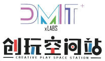

<!-- _class: notice  -->
<!-- _paginate: "" -->
<!-- _header: -->
<!-- _footer: -->

## 课程预告
### LMCC 第三课：给模拟机接上 AI，推演世界

### 学习目标
1. **开局**：年代、地点、天赋，一次说清
2. **推演**：AI 一年年现场编事件
3. **接线**：事件接回模拟机，真跑起来
4. **验收**：推错了，一句话改到对

### 学习重点

- **三要素**：角色、任务、要求
- **世界设定**：开局你定，变化它推
- **接上 AI**：事件不再从死清单里抽
- **验收**：按你说的规矩查推演

#### 授课教师： **冯世龙**
#### 上课时间： **2026-10-23（周五）16:00 ～ 18:00**

---

<!-- _class: notice  -->
<!-- _paginate: "" -->
<!-- _header: -->
<!-- _footer: -->

## 课程预告
### 让AI帮我写作文

### 学习目标
1. **审题**：圈出题眼——写谁、写什么、什么体裁、多少字
2. **列大纲**：AI 草拟，你挑毛病、你定稿——先有大纲再有作文
3. **成文**：按定稿大纲让 AI 写，不是给个题目就让它写
4. **改**：按五维评分表找最低那一维，一次只改一维

### 学习重点

- **真题实战**：用真实高考作文题——2025 北京卷「当数字闪耀时」（记叙文，要求有细节描写）
- **作文是改出来的**：初稿 55 分 → 定稿 88 分，四个版本各打一次分
- **AI 味九查**：勾中一条，语言那维扣 2 分
- **去味三动作**：念出来、盖住重说、删前补后

#### 授课教师： **冯世龙**
#### 上课时间： **2026-11-06（周五）16:00 ～ 18:00**

---

<!-- _class: notice  -->
<!-- _paginate: "" -->
<!-- _header: -->
<!-- _footer: -->

## 课程预告
### 怎么用AI学习

### 学习目标
1. **看清**：AI 在学习里能帮的三类活——讲概念、出题、析错题
2. **提要求**：角色、任务、要求、边界与验收，一次写清
3. **让它讲也让它考**：讲完必复述，出题藏答案，交卷先判对错
4. **析错加实操**：错题先要假设再挑一条，走完整条到再考做对

### 学习重点

- **四件事**：讲什么、要什么、什么规矩、怎么算过
- **讲—复述—考—挑错**：它讲完你用自己的话说，它只挑错不重写
- **错题分析**：先要假设、挑一条、只讲这条、再来一道
- **OpenMAIC**：访问码开互动课堂，测验自动评分、可离线导出

#### 授课教师： **冯世龙**
#### 上课时间： **2026-11-13（周五）16:00 ～ 18:00**

---
